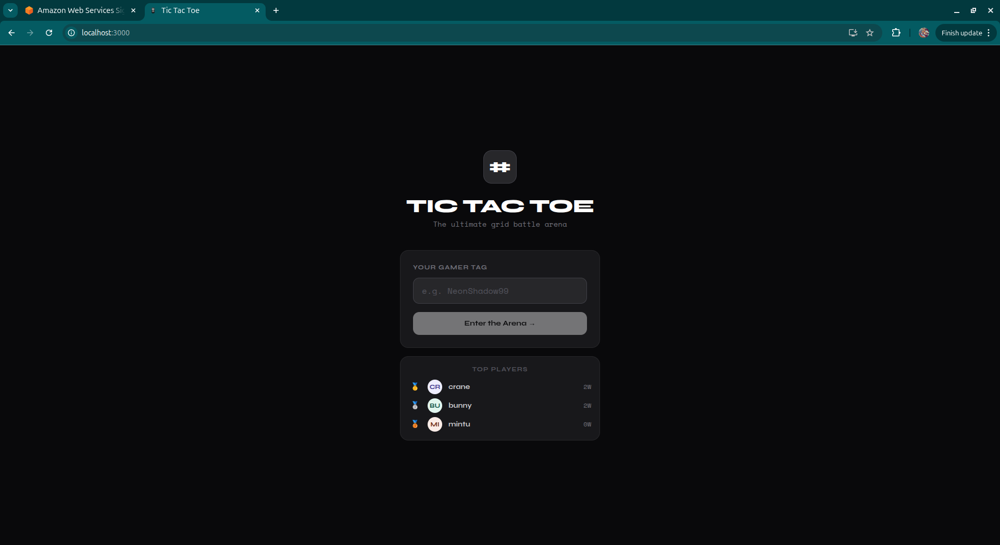
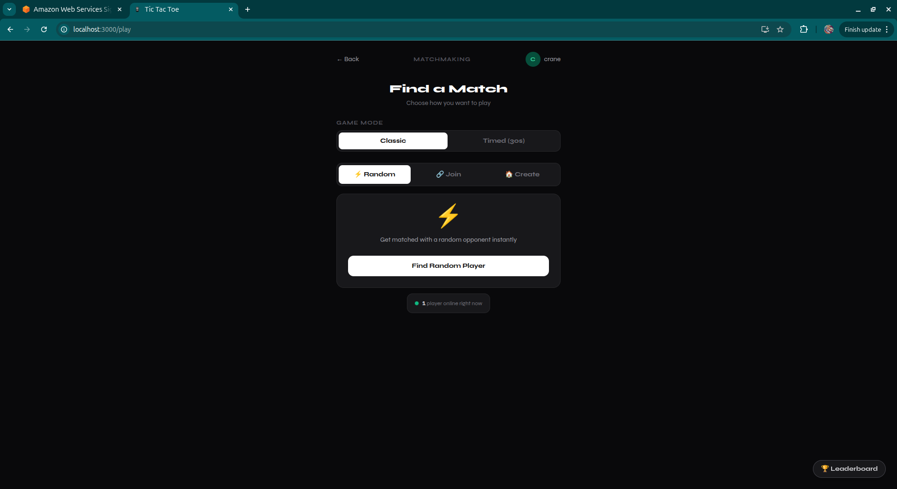
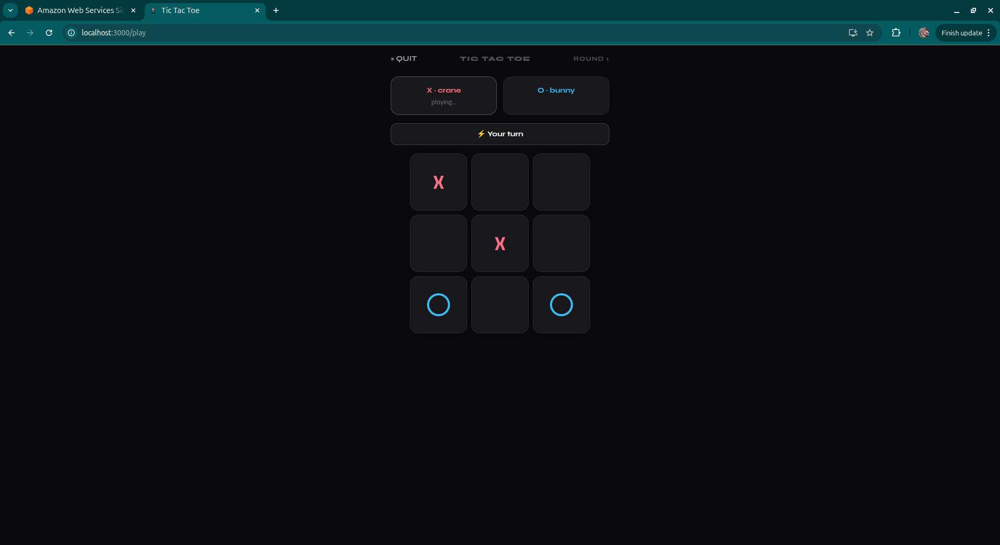
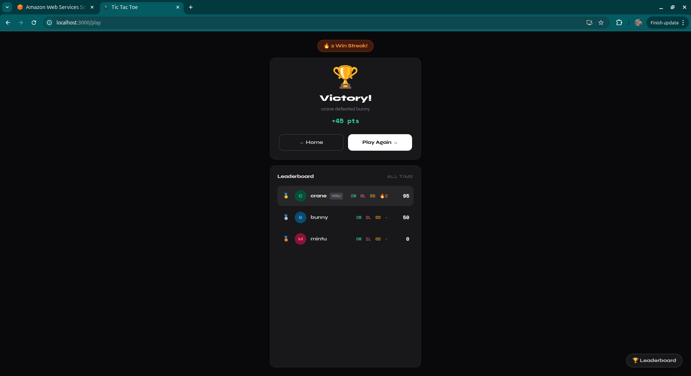
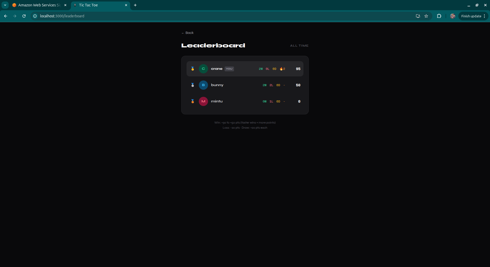

# Tic Tac Toe - Online Multiplayer

A real-time multiplayer Tic-Tac-Toe game with server-authoritative architecture, built with React and Nakama game server.

## Screenshots

| Login | Matchmaking | Gameplay |
|-------|-------------|----------|
|  |  |  |

| Game Over | Leaderboard |
|-----------|-------------|
|  |  |

## Architecture

```
┌─────────────────┐       WebSocket        ┌──────────────────┐       ┌──────────────┐
│  React Client   │ ◄───────────────────► │  Nakama Server   │ ◄───► │  PostgreSQL  │
│  (TypeScript)   │      Port 7350        │  (TypeScript RT) │       │  (Storage)   │
└─────────────────┘                       └──────────────────┘       └──────────────┘
```

### Server-Authoritative Design

All game logic runs on the Nakama server. The client only sends move requests — the server validates every move, manages game state, detects wins/draws, and broadcasts results to both players. This prevents any form of client-side cheating or state manipulation.

### How Matchmaking Works

- **Random Match**: Server finds an open match with one player waiting, or creates a new one. Players are paired automatically.
- **Private Room**: Player creates a room and gets a code. The friend enters the code to join. Private room games are **unranked** — they don't affect the global leaderboard (prevents score manipulation between friends).

### Scoring System

| Outcome | Points |
|---------|--------|
| Win in 5 moves | +50 |
| Win in 6 moves | +45 |
| Win in 7 moves | +40 |
| Win in 8 moves | +35 |
| Win in 9 moves | +30 |
| Forfeit/Timeout win | +25 |
| Draw | +20 each |
| Loss | -20 (min 0) |

Faster wins are rewarded with more points. Scores are stored in Nakama Storage (source of truth) and synced to the leaderboard for ranking.

## Tech Stack

- **Frontend**: React 18, TypeScript, Tailwind CSS
- **Backend**: Nakama 3.21.1 (TypeScript runtime)
- **Database**: PostgreSQL 12.2
- **Fonts**: Syne (UI) + Space Mono (scores/data)
- **Build**: Rollup (backend), Create React App (frontend)
- **Infrastructure**: Docker & Docker Compose

## Getting Started

### Prerequisites

- Node.js 16+
- Docker & Docker Compose

### Run Locally

**1. Start the backend:**

```bash
cd backend
npm install
npm run build
docker compose up -d
```

Wait ~15 seconds for Nakama to initialize. Verify with `curl http://localhost:7350/healthcheck`.

**2. Start the frontend:**

```bash
cd frontend
npm install
npm start
```

**3. Play:**

Open `http://localhost:3000` in two browser tabs. Enter different names, click "Find Match" in both, and play.

### Environment Variables

Create `frontend/.env` for custom server connection:

```env
REACT_APP_NAKAMA_HOST=localhost
REACT_APP_NAKAMA_PORT=7350
REACT_APP_NAKAMA_SSL=false
```

## Deployment

### Backend

1. Provision a server with Docker installed (AWS EC2, DigitalOcean, GCP, etc.)
2. Clone the repo and run:
   ```bash
   cd backend
   npm install && npm run build
   docker compose up -d
   ```
3. Open port 7350 (game API) and optionally 7351 (admin console)
4. For HTTPS, use nginx/Caddy as reverse proxy with SSL

### Frontend

```bash
cd frontend
REACT_APP_NAKAMA_HOST=your-server.com REACT_APP_NAKAMA_SSL=true npm run build
```

Deploy the `build/` folder to Vercel, Netlify, S3+CloudFront, or any static hosting.

## API Reference

### RPCs (via WebSocket)

| RPC | Payload | Description |
|-----|---------|-------------|
| `find_match` | `{ mode }` | Find or create a ranked match |
| `create_match` | `{ mode }` | Create a private unranked room |
| `get_leaderboard` | `{}` | Top 20 player rankings |
| `get_online_count` | `{}` | Current online player count |
| `health_check` | `{}` | Server health status |

### Match Communication (OpCodes)

| Code | Direction | Purpose |
|------|-----------|---------|
| 1 | Client → Server | Send move `{ position: 0-8 }` |
| 2 | Server → Client | Game state update |
| 3 | Server → Client | Game over (winner, reason, points) |
| 4 | Server → Client | Move rejected (reason) |

### Data Storage

| Collection | Key | Description |
|------------|-----|-------------|
| `player_stats` | `scores` | W/L/D, streak, total score per user |
| `match_history` | `{matchId}` | Game result, board state, opponent |
| `system` | `online_users` | Active player heartbeats |

## Admin Console

Access the Nakama admin console at `http://localhost:7351`:
- **Username**: admin
- **Password**: password

View accounts, storage data, leaderboard records, and active matches.

## Project Structure

```
├── backend/
│   ├── src/
│   │   ├── main.ts              # Module entry, registers RPCs & match handler
│   │   ├── match_handler.ts     # Game logic, move validation, scoring
│   │   ├── matchmaking.ts       # Match finding & room creation
│   │   ├── leaderboard.ts       # Leaderboard initialization & queries
│   │   └── rpc.ts               # Health check, online count
│   ├── types/                   # Nakama runtime type definitions
│   ├── docker-compose.yml       # Nakama + PostgreSQL
│   ├── local.yml                # Nakama config
│   ├── rollup.config.js         # TypeScript → JS bundler
│   └── package.json
├── frontend/
│   ├── src/
│   │   ├── components/
│   │   │   ├── LoginScreen.tsx        # Player name entry + top players
│   │   │   ├── MatchmakingScreen.tsx  # Random/Join/Create match tabs
│   │   │   ├── GameBoard.tsx          # Live game with board & timer
│   │   │   ├── GameOverScreen.tsx     # Results, points, leaderboard
│   │   │   └── LeaderboardPage.tsx    # Full leaderboard view
│   │   ├── nakama.ts            # Nakama WebSocket client
│   │   ├── App.tsx              # Router & screen management
│   │   └── App.css              # Animations
│   ├── public/index.html
│   ├── tailwind.config.js
│   └── package.json
└── README.md
```
